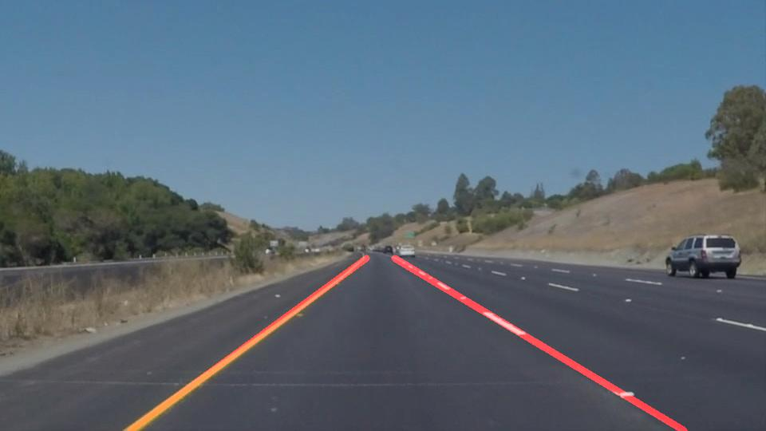

# **Finding Lane Lines on the Road** 

---

### Reflection

### 1. pipeline. 

Image processing pipeline consisted of 6 steps. 

- Convert the images to grayscale
- Apply Gaussian smoothing (kernel_size = 5)
- Use canny to find edge (low_threshold = 50, high_threshold = 150)
- Create a masked edges image (use a trapezium to select the bottom area)
- Find line segment  with `cv2.HoughLinesP` 
- Fit these line segment with linear function and get x value of  each cross at upper_y(bottom of image) and lower_y(smallest y value in chose area). Then calculate the average and draw two final lane lines. The mean values is stored in `last_state` and then used as cross in next state(for image sequence in video).  This means that the direction of lane is kept if no valid edge is found. 

 Here is a result image: 

### 2. Identify potential shortcomings with your current pipeline

Linear function is used to fit points, so the behavior of pipeline on curve lane lines may be poor.

### 3. Suggest possible improvements to your pipeline

Use parabola to fit points may behave better on curve lane line.
